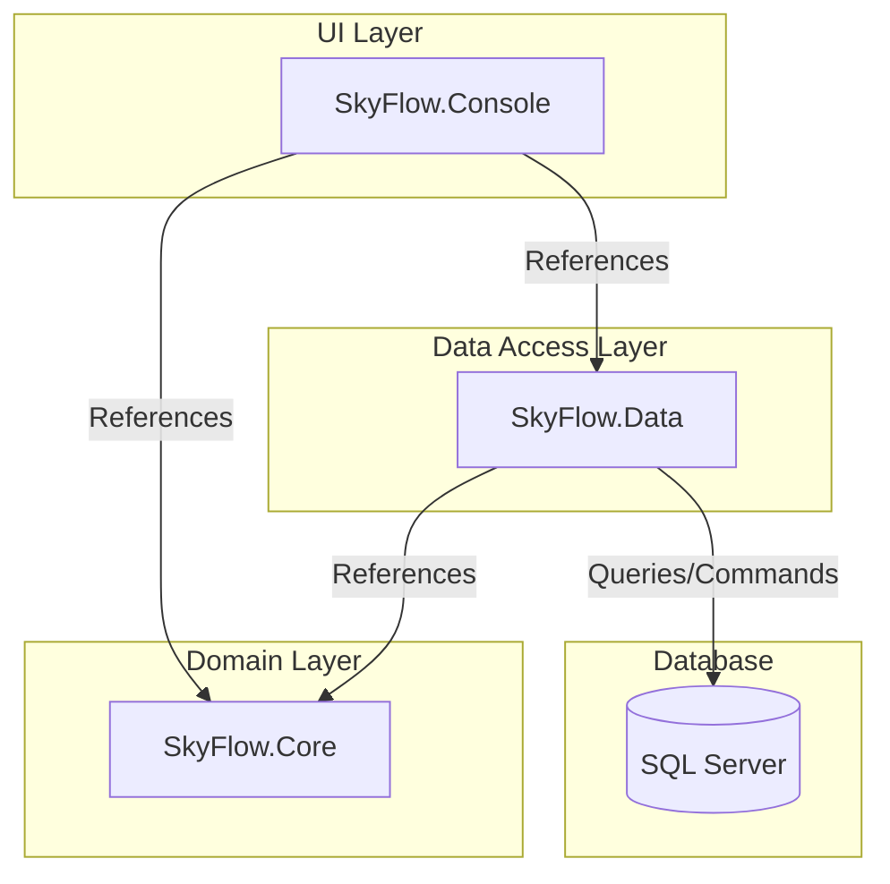
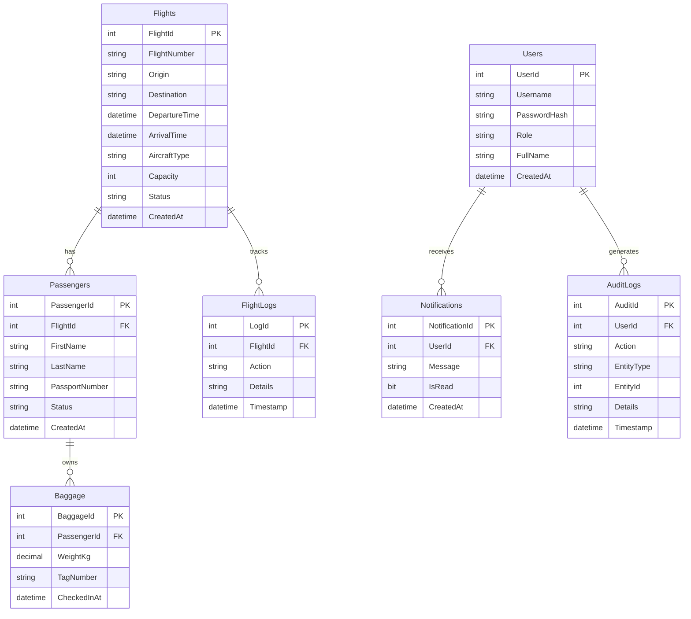

# SkyFlow Architecture and Design

This document outlines the system architecture, database design, and the application of Object-Oriented Programming (OOP) principles within the SkyFlow project.

## 1. System Architecture

SkyFlow is built using a 3-tier architecture to separate concerns, improve maintainability, and demonstrate enterprise-level design patterns. The solution is divided into three distinct .NET projects:

### Project Breakdown

1. **`SkyFlow.Core` (Domain Layer):** Contains the business logic, domain models (e.g., `Flight`, `User`, `Passenger`), enums, and repository interfaces (`IRepository<T>`). It has no dependencies on the database or UI.
2. **`SkyFlow.Data` (Data Access Layer):** Implements the repository interfaces defined in `Core`. It uses Dapper (a micro-ORM) to execute SQL queries against the SQL Server database.
3. **`SkyFlow.Console` (UI Layer):** The presentation layer. It handles user input, renders ASCII tables, manages the application loop, and orchestrates calls to the Data layer using the Domain models.

### Infrastructure & Deployment

To ensure consistency across development environments (especially between Windows and macOS/Apple Silicon), the database is containerized using Docker.

- **Container 1 (`skyflow-sql`):** Runs Microsoft SQL Server 2022. It is configured with `platform: linux/amd64` to ensure compatibility with ARM-based Macs via Rosetta emulation.
- **Container 2 (`sql-setup`):** A transient service that waits for the SQL Server to accept connections, then executes the initialization scripts (`001-create-database.sql`, `002-create-tables.sql`, `003-seed-data.sql`) using `sqlcmd`. This provides a "one-click" setup experience.

---

## 2. Database Entity-Relationship (ER) Diagram

The database is designed in SQL Server and consists of the following normalized tables to support the airline management system:

---

## 3. Object-Oriented Programming (OOP) Pillar Mapping

SkyFlow heavily utilizes the four pillars of Object-Oriented Programming to create a robust and extensible codebase. Below is a mapping of how each pillar is demonstrated in the project.

### 1. Encapsulation

**Definition:** Bundling data and the methods that operate on that data within a single unit, restricting direct access to some of the object's components.

**Implementation in SkyFlow:**

- **Class:** `SkyFlow.Core.Models.Flight`
- **Demonstration:** The `Flight` class encapsulates its `Status` property. Instead of allowing external classes to arbitrarily change the status (e.g., `flight.Status = "Departed"`), the status is modified through specific, controlled methods: `BeginBoarding()`, `DepartFlight()`, and `CancelFlight()`. These methods contain the business logic to ensure valid state transitions (e.g., a flight cannot transition directly from `Scheduled` to `Departed` without `Boarding` first).

### 2. Inheritance

**Definition:** A mechanism where a new class is derived from an existing class, inheriting its properties and behaviors.

**Implementation in SkyFlow:**

- **Classes:** `SkyFlow.Core.Models.User`, `SkyFlow.Core.Models.Admin`, `SkyFlow.Core.Models.GateAgent`
- **Demonstration:** Both `Admin` and `GateAgent` inherit from the base `User` class. They inherit common properties like `UserId`, `Username`, `PasswordHash`, and `FullName`, reducing code duplication and establishing an "is-a" relationship.

### 3. Polymorphism

**Definition:** The ability of different classes to be treated as instances of the same class through a common interface or base class, allowing methods to do different things based on the object it is acting upon.

**Implementation in SkyFlow:**

- **Method:** `DisplayDashboard()` in `SkyFlow.Core.Models.User`
- **Demonstration:** The base `User` class defines an abstract method `DisplayDashboard()`. The derived classes (`Admin` and `GateAgent`) override this method to provide their specific dashboard implementations. When the application logs a user in, it calls `user.DisplayDashboard()`, and the runtime determines whether to show the Admin menu or the Gate Agent menu based on the actual object type.

### 4. Abstraction

**Definition:** Hiding complex implementation details and showing only the essential features of the object.

**Implementation in SkyFlow:**

- **Interfaces:** `SkyFlow.Core.Interfaces.IRepository<T>`, `IFlightRepository`, `IUserRepository`
- **Demonstration:** The UI layer (`SkyFlow.Console`) interacts with the database exclusively through interfaces (e.g., `IFlightRepository`). It does not know _how_ the data is saved or retrieved (whether via Dapper, Entity Framework, or a mock in-memory list). The complex SQL queries and database connection management are abstracted away inside the `SkyFlow.Data.Repositories` classes.

---

## 4. Screenshots

_(Note: Please insert screenshots of the key screens here before generating the final PDF report.)_

- **Login Screen:** `[Insert Screenshot Here]`
- **Admin Dashboard & System Oversight:** `[Insert Screenshot Here]`
- **Gate Agent Dashboard & Flight Manifest:** `[Insert Screenshot Here]`
- **Passenger Check-in & Baggage Flow:** `[Insert Screenshot Here]`
